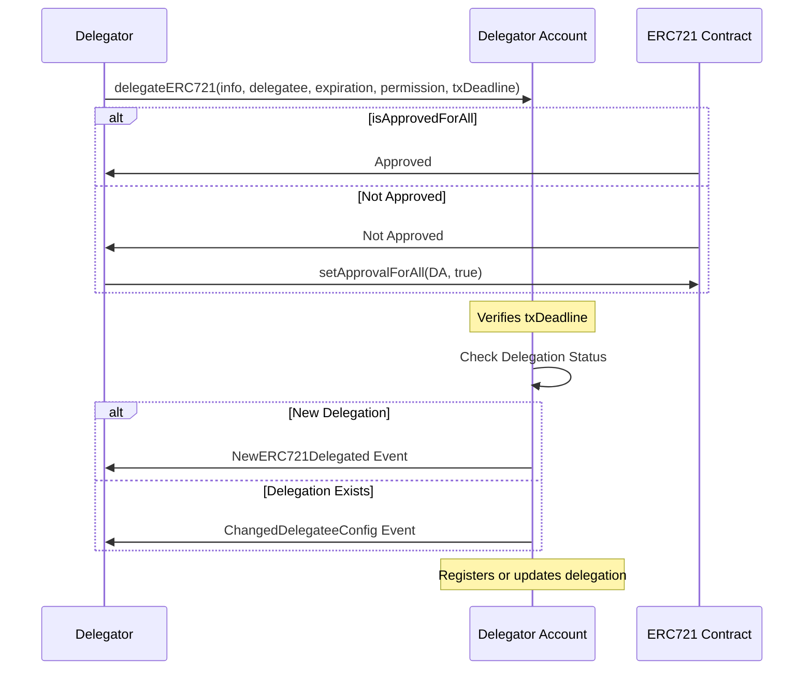

```mermaid
sequenceDiagram
    participant Delegator as Delegator
    participant DA as Delegator Account
    participant ERC721 as ERC721 Contract

    Delegator->>DA: delegateERC721(info, delegatee, expiration, permission, txDeadline)
    alt isApprovedForAll
        ERC721->>Delegator: Approved
    else Not Approved
        ERC721->>Delegator: Not Approved
        Delegator->>ERC721: setApprovalForAll(DA, true)
    end
    Note over DA: Verifies txDeadline
    DA->>DA: Check Delegation Status
    alt New Delegation
        DA->>Delegator: NewERC721Delegated Event
    else Delegation Exists
        DA->>Delegator: ChangedDelegateeConfig Event
    end
    Note over DA: Registers or updates delegation
```