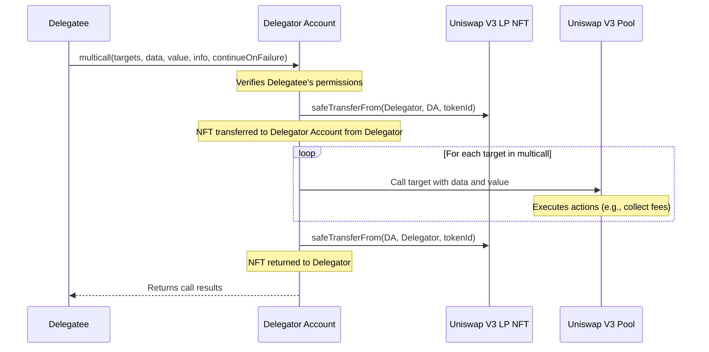

```mermaid
sequenceDiagram
    participant Delegatee as Delegatee
    participant DA as Delegator Account
    participant ERC721 as Uniswap V3 LP NFT
    participant UniV3Pool as Uniswap V3 Pool

    Delegatee->>DA: multicall(targets, data, value, info, continueOnFailure)
    Note over DA: Verifies Delegatee's permissions
    DA->>ERC721: safeTransferFrom(Delegator, DA, tokenId)
    Note over DA: NFT transferred to Delegator Account from Delegator
    loop For each target in multicall
        DA->>UniV3Pool: Call target with data and value
        Note over UniV3Pool: Executes actions (e.g., collect fees)
    end
    DA->>ERC721: safeTransferFrom(DA, Delegator, tokenId)
    Note over DA: NFT returned to Delegator
    DA-->>Delegatee: Returns call results
```